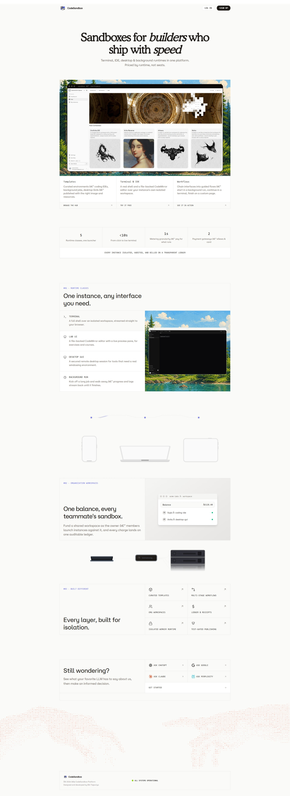

<p align="center">
  
</p>

<h1 align="center">CodeSandbox</h1>

<p align="center">
  <a href="https://github.com/Admin12121/codesandbox/stargazers">
    
  </a>
  <a href="https://github.com/Admin12121/codesandbox/issues">
    
  </a>
  <a href="https://github.com/Admin12121/codesandbox/graphs/contributors">
    
  </a>
</p>

CodeSandbox is a self-hosted platform for disposable, isolated browser workspaces. It lets users open terminals, editors, security labs, reverse-engineering environments, and background jobs without installing local tooling or trusting unknown software on their own machine.

Each workspace runs on a separate worker, streams to the browser, and is billed only for actual runtime. The platform supports individual users, organization workspaces, and platform administrators who manage users, plans, templates, workers, finance, and security policy.

Project demo video: https://www.youtube.com/watch?v=4KHG3YNbxho

## Core Features

- Disposable browser workspaces for Linux terminals, file-backed IDE sessions, desktop GUI sessions, security labs, reverse-engineering workflows, and long-running jobs.
- Template lifecycle with creation, testing, publishing, plans, pricing, capacity controls, artifacts, and hub visibility.
- Organization workspaces with members, invitations, spending limits, resource limits, approvals, and role-based permissions.
- Dual RBAC planes: platform staff permissions are isolated from organization permissions.
- Runtime billing with Decimal-based money calculations, ledger entries, top-ups, usage charges, refunds, coupons, and idempotency keys.
- Authentication with password login, TOTP, WebAuthn passkeys as second-factor verification, email verification, session revocation, and risk-based step-up.
- Platform administration for users, application staff, staff roles, organizations, templates, sandbox plans, workers, usage, ledger, and promotions.

## Architecture

The system is split into two planes:

- **Control plane:** nginx, the Flask application, bootstrap/migration jobs, and the reconciler. This plane owns authentication, authorization, template selection, billing, job assignment, and user-facing pages.
- **Runtime plane:** worker containers with their own Docker engines. This plane runs untrusted sandbox workloads and communicates with the control plane through signed jobs, scoped callbacks, Redis queues, NATS events, and Docker TLS.

This separation keeps untrusted code away from the web process. The reconciler continuously checks for worker crashes, stalled sandboxes, lost containers, missed callbacks, and billing settlement gaps.

The application is organized feature-first. Domains such as `identity`, `organizations`, `sandbox`, `billing`, `finance`, `workflow`, `worker`, and `platform_admin` keep their models, repositories, services, routes, and pages close together.

## Technology Stack

| Area | Technology |
| --- | --- |
| Web application | Flask, Jinja2, Starlette/ASGI, uvicorn |
| Routing | In-house `app_router` package with file-based pages, nested layouts, CSRF, CSP, and partial navigation |
| Database | MySQL with in-house `nexorm` ORM and generated migrations |
| Queue and cache | Redis |
| Realtime messaging | NATS |
| Object storage | MinIO/S3-compatible storage |
| Runtime isolation | Docker-in-Docker workers with Docker TLS |
| Auth and security | PBKDF2 passwords, TOTP, WebAuthn passkeys, signed CSRF tokens, signed worker callbacks, rate limiting |
| Payments | Stripe and eSewa verification flows |
| Frontend | Server-rendered Jinja templates, reusable macros, Tailwind CSS, lightweight vanilla JS partial navigation |

## Run Locally

Copy the environment template and fill the required secrets:

```bash
cp .env.example .env
```

Start the full local stack:

```bash
docker compose up --build -d
```

Open the app at:

```text
http://localhost
```

MinIO's console is available at:

```text
http://localhost:9001
```

On Docker Desktop for Windows, set `WINDOW=true` in `.env`. In that mode the app disables uvicorn reload and serves baked source plus the prebuilt Tailwind stylesheet. After changing templates, static assets, or source files in Windows mode, rebuild the image:

```bash
docker compose up --build -d
```

## Testing

Run the test automation entrypoint with:

```bash
uv run test
```

With no arguments, the runner opens the suite selector. It separates:

- **Integration tests:** component and system checks across the real app, database, Redis, MinIO, NATS, permissions, migrations, exports, and finance rules.
- **E2E tests:** complete user journeys through the HTTP interface, including account lifecycle, dual RBAC, and sandbox template lifecycle.

The runner detects a running Compose stack and executes Docker-network-dependent suites inside the `app` container when needed.

Useful direct forms:

```bash
uv run test integration all
uv run test e2e all
```

## Security Model

Security is built around least privilege, defense in depth, fail-secure behavior, server-authoritative state, and explicit trust boundaries.

- Session tokens are random, stored hash-only server side, and sent through hardened cookies.
- Passwords are salted PBKDF2 hashes.
- TOTP secrets and backup codes are encrypted at rest.
- Passkeys store public-key credentials only; private keys never leave the user's device.
- Platform RBAC and organization RBAC are independent, preventing permission bleed between staff authority and tenant authority.
- State-changing requests require signed CSRF tokens unless they are signed gateway callbacks.
- Worker jobs and callbacks are signed and scoped to their instance, job, and action.
- Payments credit balance only after server-side verification by Stripe webhook/reconciliation or eSewa HMAC plus status check.
- Runtime workloads run in Docker workers, separate from the control plane.

## Project Layout

- `src/codesandbox/features/` - feature-first application domains.
- `src/codesandbox/templates/` - Jinja layouts, pages, and reusable UI macros.
- `src/codesandbox/templates/_components/` - landing and shared page section macros.
- `packages/app_router/` - in-house Flask routing layer.
- `packages/nexorm/` - in-house ORM and migration engine.
- `worker/` - sandbox runtime worker code.
- `migrations/` - generated schema migrations.
- `src/tests/` - integration and E2E test runner and suites.
- `docker/` - nginx and runtime container configuration.

## Project Preview


